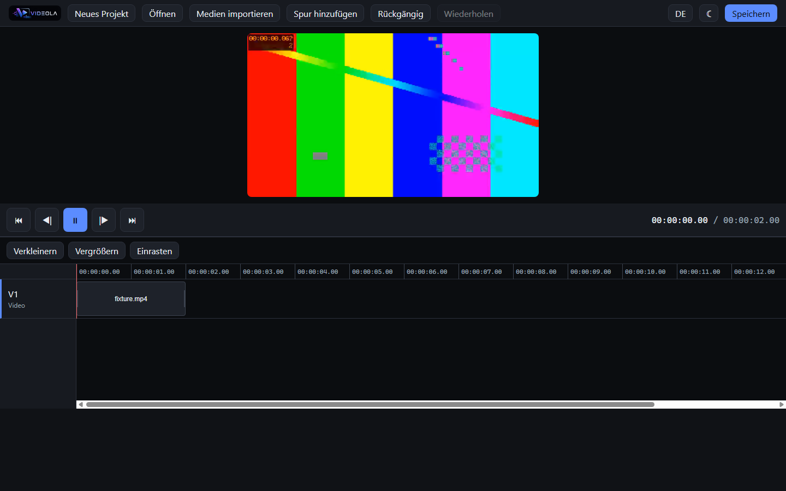

# Videola

Videola is a browser-based video editor. It is early, but it edits: drop a video in, cut it on the
timeline, press play and watch it. There is no effect, keyframe, inspector or export yet.



## What works today

- Import by drag-and-drop or file picker. Media are hashed with SHA-256 and stored in OPFS under
  that hash before anything is dispatched, so the same file imported twice is stored once.
- A timeline you can work on: move and trim clips across tracks, scrub, split and delete, snap to
  clip edges and the playhead, zoom. One Pointer Events path serves mouse, pen and touch, and hit
  areas grow to 44 px when the pointer is not a mouse. A whole drag is one undo step.
- Playback through WebCodecs decoding and a WebGL2 compositor, with the audio clock in the lead and
  a transport for play/pause, frame stepping and jumping to either end.
- A Rust core (`videola-core`) with the project data model, a command bus of 20 commands, and
  undo/redo built from JSON-Patch diffs. Time is stored as integer flicks, not float seconds.
- The `.videola` project format: a ZIP holding a manifest, `project.json`, and media files named by
  their SHA-256 hash.
- WASM bindings, so a browser drives the same Rust core, behind a TypeScript facade
  (`@videola/core`) whose model types are generated from the Rust types by ts-rs.
- An app shell (`@videola/ui`) with a dark/light/system theme, German and English catalogues, and
  layout detection for phone, tablet and desktop.
- The web app opens, switches theme and language, adds a track, undoes and redoes, saves a
  `.videola` file and reads it back.
- CI runs fmt, clippy, the Rust tests, a check that the generated TypeScript types are current, the
  wasm build, and the web typecheck, tests and build.
- Three browser harnesses that need no Playwright, only an installed Chrome: `test:gpu` renders real
  pixels against ANGLE, `test:browser` in `@videola/ui` measures real layout, and the one in
  `apps/web` drives the built application with a real video file.

## Build

Rust stable, Node 22 or newer, pnpm 11 or newer.

```
pnpm install
pnpm wasm
```

`pnpm wasm` has to run once first. `packages/core/src/wasm` is generated and not committed, and
`packages/core/src/index.ts` imports it, so `dev`, `test`, `typecheck` and `build` all fail without
it.

```
pnpm --filter videola-web dev
pnpm typecheck
pnpm test
pnpm build
```

If `wasm-opt` crashes on your machine, run the `wasm` script from `package.json` directly with
`--no-opt` added. That changes the output size only. CI builds without the flag.

## Self-hosting

```
docker build -f docker/Dockerfile -t videola:dev .
docker run --rm -p 8080:80 videola:dev
```

The image serves the web app as static files and nothing else — there is no API, no MCP endpoint and
no render worker in it yet.

## Release

Pushing a `v*` tag runs `.github/workflows/release.yml`. It creates the GitHub release as a **draft**,
so the assets can be checked before anyone sees them, and pushes the image to
`ghcr.io/fgilde/videola`.

Every signature-dependent target is bound to its secret and is skipped when the secret is absent, so
a missing certificate does not fail the whole release. The workflow summary lists each target as its
result or as `skipped`.

| Target | Secrets | Without them |
|---|---|---|
| Docker image, Windows NSIS, Linux deb and AppImage | none | built and usable, unsigned |
| macOS DMG | `APPLE_CERTIFICATE` (base64 `.p12`), `APPLE_CERTIFICATE_PASSWORD`, `APPLE_SIGNING_IDENTITY`, `APPLE_ID`, `APPLE_PASSWORD` (app-specific), `APPLE_TEAM_ID` | the DMG is still built, but unsigned, and Gatekeeper blocks it on the user's machine |
| Android APK and AAB | `ANDROID_KEYSTORE` (base64), `ANDROID_KEYSTORE_PASSWORD`, `ANDROID_KEY_ALIAS`, `ANDROID_KEY_PASSWORD` | the job is skipped; an unsigned APK cannot be installed or shipped to Play |
| iOS IPA | `IOS_CERTIFICATE` (base64 distribution `.p12`) and `IOS_MOBILE_PROVISION` (base64), plus `APPLE_CERTIFICATE_PASSWORD` and `APPLE_TEAM_ID` | the job is skipped; no distributable IPA exists without a certificate and a provisioning profile |

An installer built today packages the editor described above: import, timeline editing and playback
work, effects and export do not, so nothing can leave the application yet. FFmpeg is not bundled
either, and the Docker image only serves static files.

The published `v0.1.0` release predates all of this and installs the app frame alone.

## Layout

```
crates/videola-core       project model, command bus, undo/redo, .videola reader and writer
crates/videola-core-wasm  wasm_bindgen wrapper around the core
packages/core             @videola/core, a TypeScript facade over the WASM core
packages/ui               @videola/ui, theme, catalogues, layout detection, app shell
apps/web                  Vite app wiring the two packages together
```

## Licence

GPL-3.0-or-later, see [`LICENSE`](LICENSE). The plan is to link a GPL FFmpeg build for rendering
later, which forces that choice.

## Design spec

[`docs/superpowers/specs/2026-08-07-videola-design.md`](docs/superpowers/specs/2026-08-07-videola-design.md)
covers the architecture and the reasoning. It describes the intended full scope of the project, not
what is built today.
