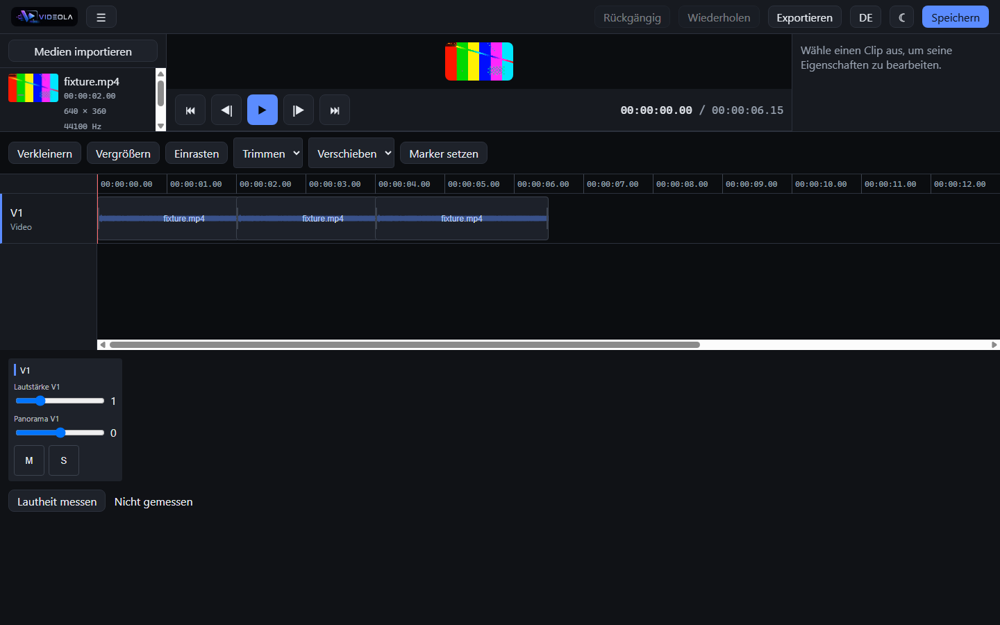

# Videola

Videola is a browser-based video editor. The chain runs end to end: drop a video in, cut it on the
timeline, add effects and keyframes, mix the audio, and export a file a player opens — on a desktop,
a tablet or a phone. There is an HTTP API and an MCP server for AI agents, and templates that bake
into ordinary editable projects.



## What works today

**Editing.** Import by drag-and-drop, file picker, or straight from a phone camera. Move and trim
clips across tracks, ripple delete and ripple trim, roll, slip and slide, multi-select, group, cut,
copy and paste, split, markers, snapping to clip edges and the playhead, zoom from a single frame to
a whole project. One Pointer Events path serves mouse, pen and touch; hit areas grow to 44 px when
the pointer is not a mouse, and a whole drag is one undo step.

**Playback.** WebCodecs decoding into a WebGL2 compositor, the audio clock in the lead, and a
transport for play/pause, frame stepping and jumping to either end.

**Effects and transitions.** Brightness, contrast, saturation, colour temperature, vignette, blur,
sharpen and chroma key; cross dissolve, wipe, slide, zoom and dip-to-colour. A text generator with
styling and in/out/loop animation. Every parameter can be keyframed, and the interpolation happens
in the Rust core so the preview and the export read the same values.

**Audio.** Per-track volume, pan, mute and solo in a mixer, fades as scheduled automation rather
than per-frame arithmetic, waveforms drawn from the buffers the graph already decoded, and EBU R128
loudness measured against the Tech 3341 conformance cases.

**Export.** MP4 with H.264 and AAC, or WebM with VP9 and Opus where the browser cannot encode
H.264. It runs in a worker through the same compositor as the preview, with progress and a cancel
that really stops it.

**Templates.** `.videolat` is the same container as `.videola` with one extra entry, so a template
*is* a project with questions attached. Pick one from the gallery, answer the wizard, and the result
is an ordinary editable project. Four templates ship, none of them carrying footage.

**An API and an MCP server.** `apps/server` exposes the whole command catalogue over HTTP and to AI
agents. The catalogue is generated from the Rust enum, so a new command becomes an agent capability
without anyone editing a list. Both transports are thin skins over one class, and not a single
scalar is re-checked there — everything goes through the same load gate the editor uses.

**The core.** `videola-core` holds the project model, a bus of 37 commands, undo and redo built from
JSON-Patch diffs, and the `.videola` reader and writer. Time is integer flicks, never float seconds;
frame rates stay rational to the last division. WASM bindings let the browser and the server drive
the same crate, behind a TypeScript facade whose model types are generated by ts-rs.

**Phone, tablet and desktop.** Not a second implementation — the same code, with the panels taking
turns behind a tab bar where there is no room for them side by side.

**Packaging.** A Tauri shell building Windows, Linux and macOS installers, and a Docker image that
serves the web app as static files.

## What is not there yet

No masks, no motion paths, no motion blur, no LUT import. No nesting of compound clips, no magnetic
timeline, no autosave recovery. No EQ or compressor — the DSP is native to the browser, but there is
nowhere in the model to persist a track-level effect yet. No noise reduction, ducking or beat
detection. FFmpeg is not bundled; the export uses the browser's own encoders.

## Build

Rust stable, Node 22 or newer, pnpm 11 or newer.

```
pnpm install
pnpm wasm
```

`pnpm wasm` has to run once first. `packages/core/src/wasm` is generated and not committed, and
`packages/core/src/index.ts` imports it, so `dev`, `test`, `typecheck` and `build` all fail without
it.

```
pnpm --filter videola-web dev
pnpm typecheck
pnpm test
pnpm build
```

Four checks need a real browser and are not part of `pnpm test`. They find Chrome on their own;
`CHROME_PATH` overrides the search.

```
pnpm --filter @videola/engine test:gpu      # the compositor against a real WebGL2 driver
pnpm --filter @videola/engine test:export   # a real export, verified with ffprobe and ffmpeg
pnpm --filter @videola/ui test:browser      # the timeline against real layout
pnpm --filter videola-web test:browser     # the built application, desktop, tablet and phone
```

`test:export` needs `ffprobe` and `ffmpeg` on the path: it hands the file it produced to a decoder
that shares no code with this repository.

If `wasm-opt` crashes on your machine, run the `wasm` script from `package.json` directly with
`--no-opt` added. That changes the output size only. CI builds without the flag.

## Self-hosting

```
docker build -f docker/Dockerfile -t videola:dev .
docker run --rm -p 8080:80 videola:dev
```

The image serves the web app as static files and nothing else — there is no API, no MCP endpoint and
no render worker in it yet.

## Release

Pushing a `v*` tag runs `.github/workflows/release.yml`. It creates the GitHub release as a **draft**,
so the assets can be checked before anyone sees them, and pushes the image to
`ghcr.io/fgilde/videola`.

Every signature-dependent target is bound to its secret and is skipped when the secret is absent, so
a missing certificate does not fail the whole release. The workflow summary lists each target as its
result or as `skipped`.

| Target | Secrets | Without them |
|---|---|---|
| Docker image, Windows NSIS, Linux deb and AppImage | none | built and usable, unsigned |
| macOS DMG | `APPLE_CERTIFICATE` (base64 `.p12`), `APPLE_CERTIFICATE_PASSWORD`, `APPLE_SIGNING_IDENTITY`, `APPLE_ID`, `APPLE_PASSWORD` (app-specific), `APPLE_TEAM_ID` | the DMG is still built, but unsigned, and Gatekeeper blocks it on the user's machine |
| Android APK and AAB | `ANDROID_KEYSTORE` (base64), `ANDROID_KEYSTORE_PASSWORD`, `ANDROID_KEY_ALIAS`, `ANDROID_KEY_PASSWORD` | the job is skipped; an unsigned APK cannot be installed or shipped to Play |
| iOS IPA | `IOS_CERTIFICATE` (base64 distribution `.p12`) and `IOS_MOBILE_PROVISION` (base64), plus `APPLE_CERTIFICATE_PASSWORD` and `APPLE_TEAM_ID` | the job is skipped; no distributable IPA exists without a certificate and a provisioning profile |

An installer built today packages the editor described above. FFmpeg is not bundled — the export
runs on the browser's own encoders — and the Docker image only serves static files.

## Layout

```
crates/videola-core       project model, command bus, undo/redo, .videola reader and writer
crates/videola-core-wasm  wasm_bindgen wrapper around the core
packages/core             @videola/core, a TypeScript facade over the WASM core
packages/media            import, OPFS storage, hashing, waveforms
packages/engine           decoding, WebGL2 compositor, effects, audio graph, clock, export
packages/ui               @videola/ui, theme, catalogues, timeline, inspector, mixer, templates
apps/web                  Vite app wiring the packages together
apps/server               videola-server, the HTTP API and the MCP server
apps/docs                 the documentation site
```

## Licence

GPL-3.0-or-later, see [`LICENSE`](LICENSE). The plan is to link a GPL FFmpeg build for rendering
later, which forces that choice.

## Design spec

[`docs/superpowers/specs/2026-08-07-videola-design.md`](docs/superpowers/specs/2026-08-07-videola-design.md)
covers the architecture and the reasoning. It describes the intended full scope of the project, not
what is built today.
