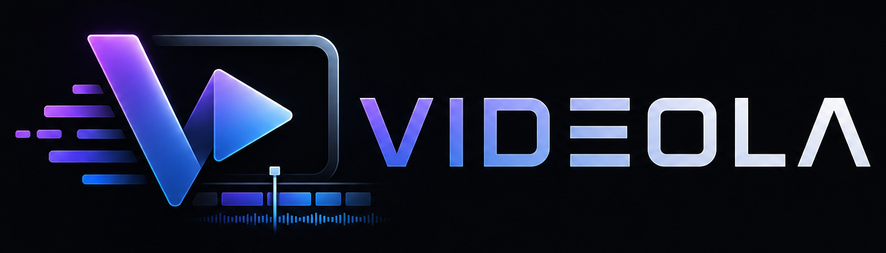
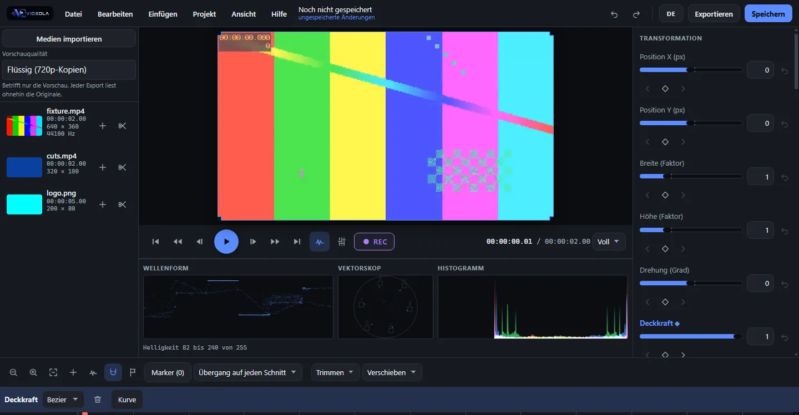

# Videola

Videola is a browser-based video editor. The chain runs end to end: drop a video in, cut it on the
timeline, add effects and keyframes, mix the audio, and export a file a player opens — on a desktop,
a tablet or a phone. There is an HTTP API and an MCP server for AI agents, and templates that bake
into ordinary editable projects.



## What works today

**Editing.** Import by drag-and-drop, file picker, or straight from a phone camera. Move and trim
clips across tracks, ripple delete and ripple trim, roll, slip and slide, multi-select, group, cut,
copy and paste, split, markers, snapping to clip edges and the playhead, zoom from a single frame to
a whole project. One Pointer Events path serves mouse, pen and touch; hit areas grow to 44 px when
the pointer is not a mouse, and a whole drag is one undo step.

**Playback.** WebCodecs decoding into a WebGL2 compositor, the audio clock in the lead, and a
transport for play/pause, frame stepping and jumping to either end.

**Effects and transitions.** Brightness, contrast, saturation, colour temperature, vignette, blur,
sharpen and chroma key; cross dissolve, wipe, slide, iris, zoom, blur dissolve and dip-to-colour;
rectangular and elliptical masks with feather and invert. A text generator with styling and
in/out/loop animation. They are picked from a browser grouped by category in which **every tile is
that effect's own shader over the frame at the playhead** — a tile that fails to change the picture
it was drawn from fails the build.

Every parameter can be keyframed, including a clip's position, scale and rotation, and a `position`
track turns a series of keys into a motion path. Keyframes are edited on a lane on the timeline's own
axis. The interpolation happens in the Rust core, so the preview and the export cannot read different
values.

**Audio.** A mixer with live meters, per-track volume, pan, mute and solo, EQ, compressor and
limiter as inserts ahead of the fader, fades as scheduled automation rather than per-frame
arithmetic, waveforms drawn from the buffers the graph already decoded. EBU R128 loudness measured
against the Tech 3341 conformance cases — and a button that normalises to a target and measures
again rather than trusting the arithmetic. Ducking writes keyframes you can see and edit; silence
detection cuts the pauses out.

**Colour.** Waveform, vectorscope and histogram read off the preview. Curves as a first-class
parameter type, keyframable point by point, plus lift/gamma/gain wheels.

**Subtitles.** SRT and WebVTT in and out, on a caption track of their own. A millisecond is exactly
705,600 flicks, so the round trip is lossless by arithmetic — and checked byte for byte through the
real core.

**Classical editing.** In and out points, insert and overwrite, J/K/L shuttle, adjustment tracks
whose effects run over everything below them, markers with colours and notes, speed ramps where the
map from project time to source time is an integral rather than a multiplication.

**Export.** MP4 with H.264 and AAC, or WebM with VP9 and Opus where the browser cannot encode
H.264. It runs in a worker through the same compositor as the preview, with progress and a cancel
that really stops it.

**Templates.** `.videolat` is the same container as `.videola` with one extra entry, so a template
*is* a project with questions attached. Pick one from the gallery, answer the wizard, and the result
is an ordinary editable project. Nine ship across five categories, none carrying footage — each is
anchored on a generator, and the gallery card is baked through the same code path a real answer
takes rather than drawn.

**Compound clips.** Fold a selection into one clip and the picture does not change — proven against
the whole frame buffer at tolerance zero, the draw list at sixteen instants, and the audio render
sample for sample. Autosave keeps the project state in OPFS and offers it back after a crash.

**An API, an MCP server and a CLI.** `apps/server` exposes the whole command catalogue over HTTP,
to AI agents and on the command line. The catalogue is generated from the Rust enum, so a new
command becomes an agent capability without anyone editing a list. All three transports are thin
skins over one class, and not a single scalar is re-checked there — everything goes through the
same load gate the editor uses.

**Agents can see their work.** `project_getFrame` renders a still at any instant and
`project_getAudioPeaks` returns the mixed waveform. The still comes out of the same wasm core, draw
list and WebGL2 compositor the editor draws with, so it cannot show something the editor would not.

**The core.** `videola-core` holds the project model, a bus of 44 commands, undo and redo built from
JSON-Patch diffs, and the `.videola` reader and writer. Time is integer flicks, never float seconds;
frame rates stay rational to the last division. WASM bindings let the browser and the server drive
the same crate, behind a TypeScript facade whose model types are generated by ts-rs.

**Phone, tablet and desktop.** Not a second implementation — the same code, with the panels taking
turns behind a tab bar where there is no room for them side by side.

**Packaging.** A Tauri shell building Windows, Linux and macOS installers with an opt-in signed
auto-update, a Docker image carrying the editor, the API and the MCP server, and a CLI that applies
a list of commands to a project without a browser.

## What is not there yet

No motion blur, no LUT import, no noise reduction, no beat detection. No curve editor for keyframe
easing: a project carrying bezier handles keeps them and keeps its shape, but nothing here can drag
one. A compound clip is flattened rather than isolated, so opacity, effects and blend apply per
nested clip instead of once over the composed picture — an adjustment track sits under the same
ceiling. `track.locked` is not enforced anywhere. The magnetic timeline is deliberately absent: the
useful half is ripple delete and trim, and the rest would change the model's overlap rule that
transitions, layering and roll/slide all depend on. FFmpeg is not bundled; the export uses the
browser's own encoders.

## Build

Rust stable, Node 22 or newer, pnpm 11 or newer.

```
pnpm install
pnpm wasm
```

`pnpm wasm` has to run once first. `packages/core/src/wasm` is generated and not committed, and
`packages/core/src/index.ts` imports it, so `dev`, `test`, `typecheck` and `build` all fail without
it.

```
pnpm --filter videola-web dev
pnpm typecheck
pnpm test
pnpm build
```

Four checks need a real browser and are not part of `pnpm test`. They find Chrome on their own;
`CHROME_PATH` overrides the search.

```
pnpm --filter @videola/engine test:gpu      # the compositor against a real WebGL2 driver
pnpm --filter @videola/engine test:export   # a real export, verified with ffprobe and ffmpeg
pnpm --filter @videola/ui test:browser      # the timeline against real layout
pnpm --filter videola-web test:browser     # the built application, desktop, tablet and phone
```

`test:export` needs `ffprobe` and `ffmpeg` on the path: it hands the file it produced to a decoder
that shares no code with this repository.

If `wasm-opt` crashes on your machine, run the `wasm` script from `package.json` directly with
`--no-opt` added. That changes the output size only. CI builds without the flag.

## Self-hosting

```
docker build -f docker/Dockerfile -t videola:dev .
docker run --rm -p 8080:7331 -e VIDEOLA_TOKEN=$(openssl rand -hex 24) -v videola:/data videola:dev
```

One Node process on port 7331 serves the editor as static files and the HTTP API under `/api`, and
the same image carries the MCP server and the batch CLI.

**The token is not optional.** A published port only reaches a process bound to `0.0.0.0`, and the
server refuses that address without `VIDEOLA_TOKEN` — without one the container exits immediately
saying so. The editor itself is served without the token, because it keeps its projects in the
visitor's own browser and reads nothing from the server; everything under `/api`, which is where the
storage root is, needs `Authorization: Bearer <token>`.

```
curl -H "Authorization: Bearer $TOKEN" http://localhost:8080/api/health
docker run -i --rm -v videola:/data videola:dev node /app/mcp.mjs      # MCP over stdio
docker run --rm -v videola:/data videola:dev node /app/cli.mjs --help  # batch editing
```

The container runs as the unprivileged `node` user, declares a health check against `/api/health`,
and keeps projects in the `/data` volume. Configuration is environment only; the full table is in
[the API guide](apps/docs/guide/api-and-mcp.md).

What it cannot do: **render or export video.** Encoding runs on the browser's own encoders, so a
`.videola` archive is the only thing the server writes. There is no render worker and no FFmpeg in
the image.

## Batch editing without a browser

`videola` applies a list of commands to a project and writes the result, through the same command
catalogue and the same core the editor uses.

```
videola schema                                    # every command, one per line
videola schema clip.add                           # one command's JSON schema
videola apply --media intro.mp4 --commands cut.json --out reel.videola
videola describe reel.videola
```

`cut.json` holds one command object or an array of them. The whole array lands as a single history
entry, and a command the core refuses takes the batch with it. Media ids are `med_` followed by the
SHA-256 of the file, so a commands file can name a medium the same run imports.

There is no `export` subcommand, for the reason above.

## Release

Pushing a `v*` tag runs `.github/workflows/release.yml`. It creates the GitHub release as a **draft**,
so the assets can be checked before anyone sees them, and pushes the image to
`ghcr.io/fgilde/videola`.

Every signature-dependent target is bound to its secret and is skipped when the secret is absent, so
a missing certificate does not fail the whole release. The workflow summary lists each target as its
result or as `skipped`.

| Target | Secrets | Without them |
|---|---|---|
| Docker image, Windows NSIS, Linux deb and AppImage | none | built and usable, unsigned |
| macOS DMG | `APPLE_CERTIFICATE` (base64 `.p12`), `APPLE_CERTIFICATE_PASSWORD`, `APPLE_SIGNING_IDENTITY`, `APPLE_ID`, `APPLE_PASSWORD` (app-specific), `APPLE_TEAM_ID` | the DMG is still built, but unsigned, and Gatekeeper blocks it on the user's machine |
| Android APK and AAB | `ANDROID_KEYSTORE` (base64), `ANDROID_KEYSTORE_PASSWORD`, `ANDROID_KEY_ALIAS`, `ANDROID_KEY_PASSWORD` | the job is skipped; an unsigned APK cannot be installed or shipped to Play |
| iOS IPA | `IOS_CERTIFICATE` (base64 distribution `.p12`) and `IOS_MOBILE_PROVISION` (base64), plus `APPLE_CERTIFICATE_PASSWORD` and `APPLE_TEAM_ID` | the job is skipped; no distributable IPA exists without a certificate and a provisioning profile |
| Desktop auto-update | `TAURI_SIGNING_PRIVATE_KEY` (from `tauri signer generate`), `TAURI_UPDATER_PUBKEY` (its public half), `TAURI_SIGNING_PRIVATE_KEY_PASSWORD` if the key has one | the installers are built as usual and simply carry no updater: the app's check finds nothing configured and stays quiet |

An installer built today packages the editor described above. FFmpeg is not bundled — the export
runs on the browser's own encoders — and the Docker image cannot render either.

## Layout

```
crates/videola-core       project model, command bus, undo/redo, .videola reader and writer
crates/videola-core-wasm  wasm_bindgen wrapper around the core
packages/core             @videola/core, a TypeScript facade over the WASM core
packages/media            import, OPFS storage, hashing, waveforms
packages/engine           decoding, WebGL2 compositor, effects, audio graph, clock, export
packages/ui               @videola/ui, theme, catalogues, timeline, inspector, mixer, templates
apps/web                  Vite app wiring the packages together
apps/server               videola-server, the HTTP API and the MCP server
apps/docs                 the documentation site
```

## Licence

GPL-3.0-or-later, see [`LICENSE`](LICENSE). The plan is to link a GPL FFmpeg build for rendering
later, which forces that choice.

## Design spec

[`docs/superpowers/specs/2026-08-07-videola-design.md`](docs/superpowers/specs/2026-08-07-videola-design.md)
covers the architecture and the reasoning. It describes the intended full scope of the project, not
what is built today.
